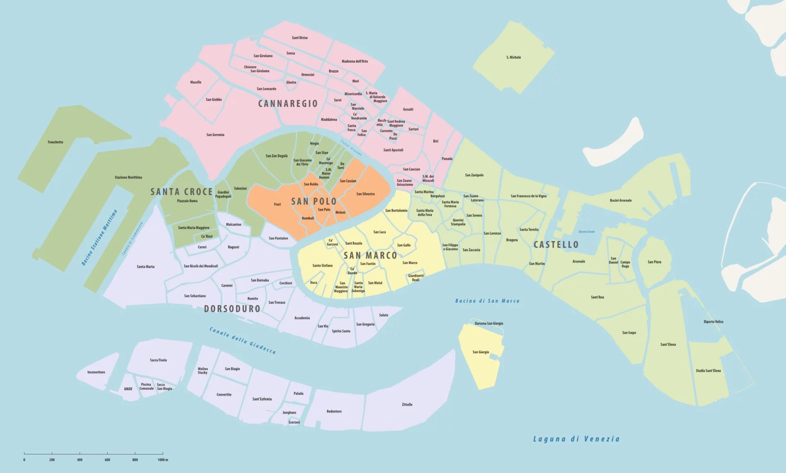
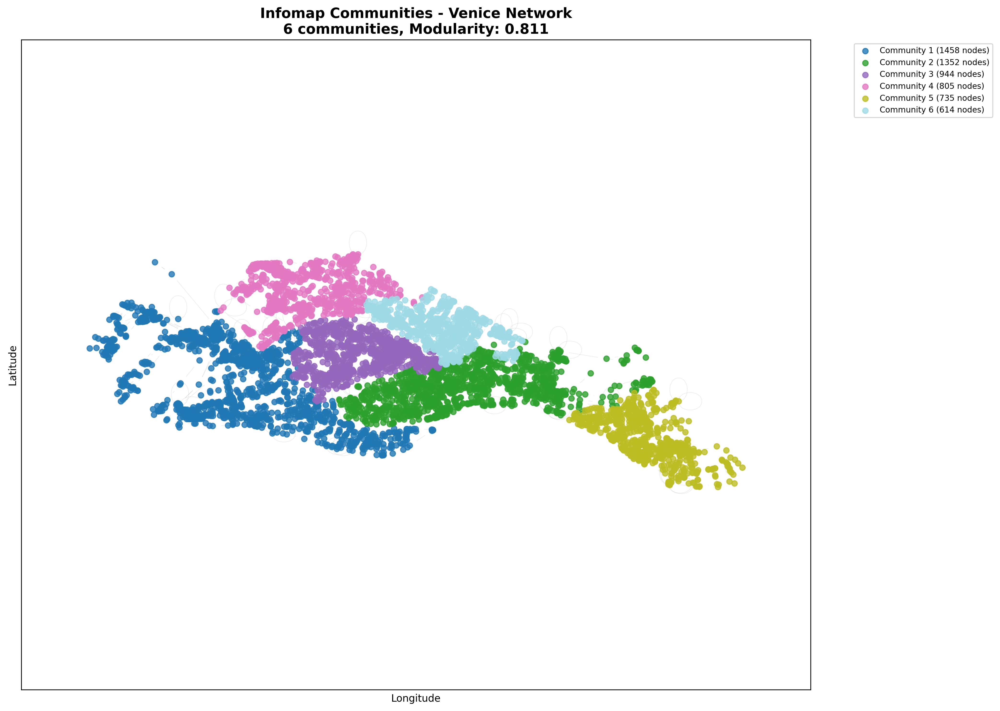

# Venice Network Analysis

## Overview

This repository contains three complementary approaches for analyzing the Venice street network, each revealing different aspects of the city's unique urban structure:

1. **Network Acquisition & Infomap Community Detection (Python)** - Downloads Venice street network data and identifies natural neighborhoods using information-theoretic community detection.
2. **Girvan-Newman Community Detection (Python)** - Alternative hierarchical community detection method for comparative analysis.
3. **Memory-Biased Random Walk & Spectral Dimension Analysis (MATLAB)** - Characterizes the network's fractal properties and geometric scaling behavior.

### What This Repository Contains

- **Script 1** (`venice_network_infomap.py`) - Network download from OpenStreetMap and Infomap community detection with visualizations
- **Script 2** (`venice_girvan_newman.py`) - Girvan-Newman algorithm implementation (computationally intensive, **currently commented out**)
- **Script 3** (`MBRW_SPECTRAL_DIMENSION_DEMO.m`) - MATLAB implementation of MBRW with spectral dimension computation
- **Data Processing** - Automated data acquisition, preprocessing, and format conversion
- **Visualizations** - Publication-quality figures showing community structure, hierarchies, and spectral properties
- **Analysis Results** - CSV files with community assignments, network statistics, and spectral measurements

---

## Table of Contents

- [Requirements & Installation](#requirements--installation)
- [Method 1: Network Download & Infomap Community Detection](#method-1-network-download--infomap-community-detection)
- [Method 2: Girvan-Newman Community Detection](#method-2-girvan-newman-community-detection)
- [Method 3: MBRW Spectral Dimension Analysis](#method-3-mbrw-spectral-dimension-analysis)
- [Results Interpretation](#results-interpretation)
- [References](#references)

---

## Requirements & Installation

### Python Requirements (Methods 1 & 2)

```python
pandas
osmnx
networkx
numpy
scipy
infomap
matplotlib
```

**Installation:**
```bash
pip install pandas osmnx networkx numpy scipy infomap matplotlib
```

### MATLAB Requirements (Method 3)

- MATLAB R2018b or later
- Statistics and Machine Learning Toolbox
- Boost C++ Libraries (for MBRW compilation)
- C++ compiler (g++ for Linux/Mac, MinGW or MSVC for Windows)

### External Tools

- **Infomap executable** (optional for Method 3, enhances MATLAB performance)
  - Windows: [Download Infomap-win64.zip](https://github.com/mapequation/infomap/releases/latest/download/Infomap-win64.zip)
  - Linux/Mac: [Installation guide](https://www.mapequation.org/infomap/#Install)

### MATLAB Setup Instructions

1. **Install Boost C++ Libraries:**
   - Download from [boost.org](https://www.boost.org/)
   - Extract to a known location (e.g., `C:\boost_1_89_0`)
   - Update the `boost_path` variable in the MATLAB script

2. **Set up C++ compiler:**
   ```matlab
   % In MATLAB, verify compiler setup
   mex -setup C++
   ```

3. **Install Infomap (optional):**
   - Download the appropriate binary for your system
   - Place in MATLAB working directory or add to system PATH

---

# Method 1: Network Download & Infomap Community Detection

## Overview

This method downloads the Venice street network from OpenStreetMap and applies the Infomap algorithm to detect natural communities within the urban structure. The analysis identifies distinct neighborhoods based on how streets and intersections are connected.

## Methodology

### Network Data Acquisition

**OpenStreetMap (OSM)** is a collaborative project providing free geographic data worldwide. The `osmnx` library provides a Python interface to:
- Query OSM databases by place name or bounding box
- Download street network data with geographic coordinates
- Convert raw data into graph structures suitable for analysis

### Why Venice? 
- Unique canal-constrained geography
- Well-defined historical districts (sestieri)
- Complex multi-island structure
- Ideal test case for spatial network analysis

### What is Infomap?

Infomap is a community detection algorithm based on information theory and random walks. It works by:

1. Simulating a random walker traversing the network
2. Finding the optimal way to compress the description of this walk using a two-level codebook
3. Using community structure to achieve better compression - communities are regions where the walker spends more time

**Key principle:** If you can describe the walker's path more efficiently by giving communities their own "local" names, then those communities are meaningful structures.

**Advantages:**
- Information-theoretic foundation (principled approach)
- Fast: O(E log E) complexity
- Naturally handles weighted and directed networks
- Particularly effective for spatial networks

## Code Workflow

### Step 1: Network Data Download

```python
place_name = "Venezia-Murano-Burano, Veneto, Italy"
graph = ox.graph_from_place(place_name, network_type="all")
```

**Purpose:** Acquire the complete street network data for Venice from OpenStreetMap.

**Parameters:**
- `place_name`: Includes Venice main islands plus Murano and Burano
- `network_type="all"`: Downloads all types of roads (streets, paths, walkways, bridges)

**What gets downloaded:**
- **Nodes:** Intersections and dead-ends with latitude/longitude coordinates
- **Edges:** Street segments connecting nodes, with attributes like street name, length, type
- **Metadata:** Additional information about one-way streets, surface types, etc.

**Output:** 
- Directed graph object in memory
- Saved as `venice.graphml` for reuse and portability


*Figure 1: Raw Venice street network downloaded from OpenStreetMap*

---

### Step 2: Graph Preprocessing

```python
G = graph.to_undirected()

if not nx.is_connected(G):
    largest_cc = max(nx.connected_components(G), key=len)
    G = G.subgraph(largest_cc).copy()
```

**Purpose:** Prepare the graph for community detection analysis.

**Operations:**

1. **Convert to undirected:** 
   - Original OSM data includes one-way streets (directed edges)
   - Community detection works better on undirected graphs
   - Treats all connections as bidirectional relationships

2. **Extract largest connected component:**
   - Venice has some small isolated islands or disconnected paths
   - Community detection requires a connected graph
   - Largest component represents the main Venice network
   - Typically retains >95% of original nodes

**Why this matters:** Disconnected components would be trivially identified as separate communities, which doesn't provide useful insights. We want to find structure *within* the connected network.

---

### Step 3: Infomap Algorithm Configuration

```python
im = infomap.Infomap("--two-level --markov-time 50.0 --seed 42")
```

**Parameters Explained:**

- **`--two-level`**: Restricts algorithm to find flat partition (network → communities)
  - Alternative: hierarchical (network → super-communities → communities)
  - Two-level is simpler to interpret and visualize

- **`--markov-time 50.0`**: Resolution parameter controlling community size
  - Higher values (100+) → Larger, fewer communities
  - Lower values (20-40) → Smaller, more communities
  - Value of 50 chosen to balance granularity with interpretability
  - Roughly corresponds to "how far can you walk before leaving the community"

- **`--seed 42`**: Random number generator seed for reproducibility
  - Algorithm has stochastic elements
  - Same seed = same results every time
  - Critical for scientific reproducibility

---

### Step 4: Node ID Mapping

```python
node_to_int = {node: i for i, node in enumerate(node_list)}
int_to_node = {i: node for node, i in node_to_int.items()}
```

**Purpose:** Convert OSM node IDs to sequential integers required by Infomap.

**Why necessary:**
- OSM uses large integers (e.g., 123456789) as node IDs
- Infomap expects sequential IDs (0, 1, 2, 3, ...)
- Mapping ensures compatibility and memory efficiency

**Process:**
1. Create forward mapping: OSM_ID → Sequential_ID
2. Create reverse mapping: Sequential_ID → OSM_ID
3. Use forward mapping to add edges to Infomap
4. Use reverse mapping to interpret results

---

### Step 5: Algorithm Execution

```python
for edge in G.edges():
    source_int = node_to_int[edge[0]]
    target_int = node_to_int[edge[1]]
    im.add_link(source_int, target_int)

im.run()
```

**Purpose:** Run the Infomap algorithm on the Venice network.

**Process:**
1. Add all edges to Infomap instance using integer IDs
2. Execute algorithm (typically completes in seconds)
3. Extract results from the tree structure

**Output metrics:**
- **Number of communities:** How many distinct regions were found
- **Codelength:** Information-theoretic measure of compression quality (lower is better)
- **Module assignments:** Which community each node belongs to

---

### Step 6: Results Extraction and Modularity Calculation

```python
infomap_communities = {
    int_to_node[node_int]: module 
    for node_int, module in infomap_communities_int.items()
}

infomap_modularity = nx.algorithms.community.modularity(G, infomap_comm_list)
```

**Purpose:** Convert results back to original node IDs and evaluate quality.

**Modularity:**
- Standard metric for community quality (range: -1 to 1)
- Compares actual community structure to random expectation
- **Q > 0.3**: Strong community structure
- **Q > 0.5**: Very strong community structure
- **Q < 0.2**: Weak or no community structure

**Community statistics calculated:**
- Number of communities
- Size of each community (number of nodes)
- Geographic bounds (longitude/latitude ranges)
- Network density within each community

---

## Visualizations

### Visualization 1: Basic Community Map

```python
# All communities shown with different colors
```

**Purpose:** Overview of the complete community structure in geographic space.

**Features:**
- Each community rendered in unique color (up to 20 distinct colors)
- Node size: 30 pixels for visibility
- Edges: Gray with 15% transparency to show connectivity without cluttering
- Legend: Lists all communities with their sizes
- Title: Shows number of communities and modularity score




*Figure 2: Complete community structure of Venice street network with Infomap detection*

**Interpretation:** 
- Look for spatial coherence (communities as contiguous regions)
- Identify natural barriers (canals, large streets) separating communities
- Compare with known Venice neighborhoods (sestieri)

---

### Visualization 2: Multi-Panel Detailed Analysis

Four complementary views in a single figure:

#### Panel A: Community Distribution Map
- All nodes colored by community membership
- Geographic layout using true coordinates
- Comprehensive view of spatial organization

#### Panel B: Community Size Distribution
- Histogram showing frequency of different community sizes
- Reveals whether structure is balanced or hierarchical
- Helps identify dominant communities

#### Panel C: Top 5 Largest Communities Highlighted
- Background nodes in light gray for context
- Five largest communities in distinct bright colors
- Focus on major structural divisions

#### Panel D: Size vs. Geographic Spread Scatter Plot
- X-axis: Number of nodes in community
- Y-axis: Geographic extent (computed from coordinate range)
- Each point is a community, colored by ID
- Reveals compact vs. dispersed communities


*Figure 3: Four-panel detailed analysis of community structure*

**Interpretation:**
- **Panel A:** Overall structure and spatial patterns
- **Panel B:** Distribution shows hierarchy or balance
- **Panel C:** Major divisions of the city
- **Panel D:** Relationship between size and geography
  - Linear relationship → communities grow spatially
  - Outliers → unusually compact or dispersed regions

---

### Visualization 3: Individual Community Analysis

```python
# Top 6 largest communities shown individually
```

**Purpose:** Detailed examination of major communities in isolation.

**For each of the 6 largest communities:**
- Background: All nodes in light gray (context)
- Highlight: Community nodes in red, size 40 pixels
- Internal edges: Red, thick (1.0 width)
- Statistics: Size, number of internal edges
- Geographic context: Community position relative to whole network


*Figure 4: Individual visualizations of the six largest communities*

**Interpretation:**
- **Shape:** Linear (canal-following) vs. compact (island-centered)
- **Density:** Number of internal connections
- **Position:** Which part of Venice (north, south, main island, outer islands)
- **Boundaries:** How community interfaces with neighbors

**Use cases:**
- Identifying specific neighborhoods
- Understanding local connectivity patterns
- Finding natural entry/exit points

---

### Visualization 4: Density Heatmap Analysis

Two complementary views:

#### Left Panel: Community Membership
- Scatter plot with nodes colored by community ID
- Colorbar showing community assignments
- Clear visualization of boundaries

#### Right Panel: Geographic Density
- Heatmap showing local node density
- Uses spatial KD-tree for efficient radius queries
- Warmer colors (red/orange) = denser street networks
- Cooler colors (yellow) = sparser areas


*Figure 5: Community membership and geographic density comparison*

**Interpretation:**
- Compare community boundaries with density patterns
- High-density areas often form community cores
- Low-density regions may be boundaries or parks
- Reveals whether communities correspond to dense vs. sparse regions

**Technical note:** Density computed using `radius = 0.001` (coordinate units), counting neighbors within this distance.

---

## Output Files

### 1. `venice.graphml`

**Format:** GraphML (Graph Markup Language) - XML-based graph format

**Contents:**
- All nodes with their OSM IDs and coordinates
- All edges with their connections
- Metadata attributes (street names, types, etc.)

**Usage:**
- Can be loaded into Gephi for additional visualization
- Reusable for other analyses without re-downloading
- Portable across different graph libraries

---

### 2. `venice_infomap_communities.csv`

**Format:** CSV with node-level community assignments

| Column | Description |
|--------|-------------|
| `node_id` | Original OSM node identifier |
| `longitude` | East-West coordinate |
| `latitude` | North-South coordinate |
| `infomap_community` | Assigned community ID (0, 1, 2, ...) |

**Usage:**
- Import into GIS software (QGIS, ArcGIS)
- Further statistical analysis
- Correlation with demographic or economic data
- Validation against official boundaries

**Example rows:**
```
node_id,longitude,latitude,infomap_community
260616588,12.3377289,45.4371711,0
260616589,12.3378123,45.4372456,0
260616590,12.3375678,45.4369234,1
```

---

### 3. `venice_infomap_community_stats.csv`

**Format:** CSV with community-level aggregated statistics

| Column | Description |
|--------|-------------|
| `community_id` | Unique community identifier |
| `size` | Number of nodes (intersections) |
| `num_edges` | Number of internal connections |
| `density` | Network density (0 to 1) |
| `center_lon` | Geographic center longitude |
| `center_lat` | Geographic center latitude |
| `lon_min`, `lon_max` | Longitude bounding box |
| `lat_min`, `lat_max` | Latitude bounding box |

**Computed metrics:**

- **Density** = (actual edges) / (possible edges) = E / [N(N-1)/2]
  - Density = 1: Fully connected (every node connected to every other)
  - Density = 0: No internal connections
  - Typical range: 0.01 - 0.15 for spatial networks

- **Geographic center**: Mean of all node coordinates
- **Bounding box**: Smallest rectangle containing all community nodes

**Usage:**
- Quantitative comparison between communities
- Statistical analysis of community characteristics
- Identifying outliers (unusually large, dense, or dispersed)

---

## Community Statistics Output

The script prints detailed statistics for the top 5 largest communities:

```
Community 0 (Rank #1):
  Size: 2847 nodes
  Geographic center: (12.338456, 45.437234)
  Geographic bounds:
    Longitude: [12.315678, 12.356789]
    Latitude:  [45.425678, 45.448901]
  Network statistics:
    Edges: 3456
    Density: 0.0856
    Avg clustering: 0.2341
```

**Interpretation:**
- **Size:** Larger communities may represent main islands or districts
- **Center:** Can be mapped to actual Venice locations
- **Bounds:** Geographic extent of the community
- **Edges:** More edges = better internal connectivity
- **Density:** Higher = more connected (grid-like vs. tree-like)
- **Clustering:** Local connectivity measure (0 to 1)

---

# Method 2: Girvan-Newman Community Detection

## Overview

This method provides an alternative hierarchical approach to community detection. Unlike Infomap's information-theoretic method, Girvan-Newman uses edge betweenness to progressively divide the network. **Currently commented out** due to computational intensity, but included for comparative analysis.

## Methodology

### What is Girvan-Newman?

The Girvan-Newman algorithm is a **divisive hierarchical clustering** method that works by:

1. **Computing edge betweenness:** For each edge, count how many shortest paths between all node pairs pass through it
2. **Removing highest betweenness edge:** The edge most "between" communities is likely a bridge
3. **Recalculating betweenness:** After removal, recompute for remaining edges
4. **Iterating:** Repeat until network is fully decomposed
5. **Creating dendrogram:** Track the sequence of divisions

**Key insight:** Edges connecting different communities will have high betweenness because they're on many shortest paths. Removing them reveals community structure.

### Hierarchical Output

Unlike Infomap's flat partition, Girvan-Newman produces a **hierarchy:**

```
Level 0: 1 community (entire network)
Level 1: 2 communities (first major split)
Level 2: 3 communities (next split)
Level 3: 4 communities
...
Level N: N+1 communities (every node isolated)
```

This allows exploring community structure at multiple resolutions.

## Comparison with Infomap

| Aspect | Infomap | Girvan-Newman |
|--------|---------|---------------|
| **Approach** | Information-theoretic (random walks, compression) | Structural (edge betweenness, shortest paths) |
| **Output** | Single flat partition | Hierarchical dendrogram |
| **Speed** | Fast: O(E log E) | Slow: O(m²n) to O(m²n²) |
| **Memory** | Modest: O(N + E) | High: O(N²) for betweenness |
| **Best for** | Large networks, single resolution | Small networks, multi-scale analysis |
| **Resolution control** | Markov time parameter | Choose level in hierarchy |
| **Deterministic** | Stochastic (needs seed) | Deterministic (same input = same output) |

**Why it's commented out for Venice:**
- Venice network: ~30,000 nodes, ~40,000 edges
- Girvan-Newman: Estimated 30-120 minutes per run
- Multiple iterations needed to explore hierarchy: 10 × 30min = 5+ hours
- Infomap completes same analysis in ~5 seconds

## Code Implementation

### Step 1: Hierarchical Community Generation

```python
from networkx.algorithms.community import girvan_newman

gn_iterator = girvan_newman(G)
max_levels = 10  # Limit iterations for computational efficiency
```

**Purpose:** Generate community structures at multiple scales.

**Process:**
- `girvan_newman(G)` returns an iterator (lazy evaluation)
- Each iteration removes one edge and recalculates
- `max_levels = 10` limits to first 10 divisions (2 to 11 communities)
- Full decomposition (to N communities) would be impractically slow

---

### Step 2: Modularity Tracking

```python
for i, communities in enumerate(gn_iterator):
    if i >= max_levels:
        break
    
    comm_list = [set(c) for c in communities]
    modularity = nx.algorithms.community.modularity(G, comm_list)
    
    gn_communities_levels.append({
        'level': i,
        'num_communities': len(comm_list),
        'communities': comm_list,
        'modularity': modularity
    })
```

**Purpose:** Evaluate quality of partitions at each hierarchical level.

**Why track modularity:**
- Not all levels in the hierarchy are equally meaningful
- Modularity peaks at the "natural" scale of community structure
- Highest modularity level is typically chosen as the best partition

**Output:** List of partitions with their modularity scores, allowing selection of optimal resolution.

---

### Step 3: Best Level Selection

```python
best_level = max(gn_communities_levels, key=lambda x: x['modularity'])
gn_comm_list = best_level['communities']
gn_modularity = best_level['modularity']
```

**Purpose:** Automatically select the hierarchical level with strongest community structure.

**Alternative strategies:**
- Choose level with specific number of communities (e.g., 6 for Venice sestieri)
- Use domain knowledge about expected structure
- Visualize entire hierarchy and manually select

---

### Step 4: Comparison with Infomap

```python
print(f"Infomap:")
print(f"  Communities: {len(infomap_comm_list)}")
print(f"  Modularity: {infomap_modularity:.4f}")

print(f"Girvan-Newman:")
print(f"  Communities: {len(gn_comm_list)}")
print(f"  Modularity: {gn_modularity:.4f}")
```

**Purpose:** Quantitative comparison of both methods.

**What to compare:**
- **Number of communities:** Do methods agree on scale?
- **Modularity:** Which produces stronger structure?
- **Community sizes:** Similar distributions?
- **Geographic coherence:** Do communities make spatial sense?

**Expected outcomes:**
- Methods rarely produce identical results
- Both should have Q > 0.3 for Venice
- Infomap often produces slightly higher modularity
- Spatial coherence should be similar if both are valid

---

## Visualization

```python
fig, axes = plt.subplots(1, 2, figsize=(20, 10))
```

**Purpose:** Side-by-side comparison of Infomap and Girvan-Newman results.

**Left plot:** Infomap communities
**Right plot:** Girvan-Newman communities (at best modularity level)

**Visual comparison allows:**
- Identifying agreement (similar community boundaries)
- Spotting differences (where methods disagree)
- Evaluating spatial coherence
- Validating both methods

********ADD EXAMPLE IMAGE HERE**********
*Figure 6: Side-by-side comparison of Infomap and Girvan-Newman community detection*

---

## Detailed Community Analysis

```python
def analyze_communities(communities, name):
    for i, comm in enumerate(sorted(communities, key=len, reverse=True)[:5]):
        # Print statistics for top 5 communities
```

**Purpose:** Compare community characteristics across both methods.

**For each method's top 5 communities:**
- Geographic bounds (longitude/latitude ranges)
- Geographic spread (diagonal of bounding box)
- Size in nodes
- Internal connectivity

**Use cases:**
- Validating consistency between methods
- Identifying robust communities (found by both methods)
- Understanding method-specific biases

---

## Output Files

### `venice_community_detection_results.csv`

**Format:** CSV with results from both methods

| Column | Description |
|--------|-------------|
| `node_id` | OSM node identifier |
| `longitude` | Geographic coordinate |
| `latitude` | Geographic coordinate |
| `infomap_community` | Infomap community ID |
| `girvan_newman_community` | Girvan-Newman community ID |

**Usage:**
- Direct comparison of community assignments
- Compute agreement metrics (Normalized Mutual Information, Adjusted Rand Index)
- Identify nodes where methods disagree (boundary regions)
- Statistical analysis of consistency

---

## When to Enable Girvan-Newman

**Enable if:**
- Working with smaller networks (< 1,000 nodes)
- Need hierarchical community structure
- Have computational resources (multi-core CPU, time)
- Want method validation and comparison
- Studying multi-scale organization

**Keep disabled if:**
- Working with large networks (> 10,000 nodes)
- Only need single-resolution partition
- Limited computational time
- Primary interest in fast analysis

**Computational estimates for Venice:**
- **Full 10 levels:** 30-120 minutes (depends on hardware)
- **Single level:** 3-12 minutes
- **Recommendation:** Run overnight or on computing cluster

---

## Enabling the Algorithm

To run Girvan-Newman analysis:

1. **Locate the commented section** in the Python script
2. **Uncomment** the entire Girvan-Newman block
3. **Adjust parameters** if needed:
   ```python
   max_levels = 10  # Reduce to 5 for faster execution
   ```
4. **Run the script** and monitor progress
5. **Compare results** with Infomap

**Testing recommendation:** First test on a smaller network or subgraph to estimate runtime.

---

# Method 3: MBRW Spectral Dimension Analysis

## Overview

This MATLAB-based method characterizes the **geometric and fractal properties** of the Venice street network using Memory-Biased Random Walks (MBRW). While Methods 1 and 2 identify *what* the communities are, Method 3 reveals *how* the network scales across different size ranges - from individual streets to the entire city.

## Methodology

### What is Memory-Biased Random Walk?

MBRW is an enhanced random walk process that explores network structure more effectively than simple random walks:

**Standard Random Walk:**
- At each step, randomly choose a neighbor
- Problem: Frequently backtracks, doesn't explore efficiently
- Like a drunk person wandering aimlessly

**Memory-Biased Random Walk:**
- Remembers recently visited nodes (memory)
- Heavily penalizes returning to recent locations (bias)
- Explores systematically like an intentional navigator

**Mathematical formulation:**
- **Memory (m):** Remember last m visited nodes
- **Bias (b):** Probability of revisiting recent nodes reduced by factor b
- Transitions: P(i→j) ∝ 1/b if j was visited recently, ∝ 1 otherwise

### What is Spectral Dimension?

The **spectral dimension** (Dq) generalizes the concept of dimensionality for complex networks:

**Intuition:**
- **D = 1:** Network behaves like a line (1-dimensional)
- **D = 2:** Network behaves like a plane (2-dimensional)
- **D = 3:** Network behaves like a volume (3-dimensional)
- **1 < D < 2:** Fractal structure (incomplete space-filling)

**Technical definition:**
Dq measures how the "mass" (number of visited nodes) scales with "radius" (walk length):

Mass(L) ∝ L^(Dq)

where L is the walk length and q is the moment order.

**Multiple dimensions (Dq spectrum):**
- **q → -∞:** Emphasizes rarely visited regions
- **q = 0:** Counts distinct visited nodes
- **q = 1:** Entropy-based (information dimension)
- **q = 2:** Variance-based (correlation dimension)
- **q → +∞:** Emphasizes frequently visited regions

**Multifractality:**
If Dq varies with q, the network is **multifractal** - different parts have different scaling properties. This indicates hierarchical organization.

### Why This Matters for Venice

Venice's unique structure creates interesting geometric properties:

1. **Canal constraints:** Limit connectivity, creating fractal-like patterns
2. **Bridge bottlenecks:** Create hierarchical scales (local islands, bridge connections, city-wide)
3. **Historical growth:** Organic development leads to self-similar patterns
4. **Spatial embedding:** Unlike online networks, Venice is constrained to 2D space

**Expected findings:**
- **Dq ≈ 1.5-2.2:** Between linear and fully planar
- **ΔDq > 0:** Multifractal behavior from heterogeneous structure
- **Correlations:** Spectral dimension changes may align with community boundaries

## Code Workflow (MATLAB)

### Step 1: Network Loading and Preprocessing

```matlab
venice_graphml_file = 'networks/venice.graphml';
```

**Purpose:** Load the Venice network exported from the Python script.

**Streaming parser implementation:**
```matlab
fid = fopen(venice_graphml_file, 'r', 'n', 'UTF-8');
while ~feof(fid)
    line = fgetl(fid);
    % Parse nodes and edges line-by-line
end
```

**Why streaming?**
- GraphML files can be 50-200 MB for large networks
- Loading entire file into memory inefficient
- Line-by-line processing keeps memory footprint low
- Enables processing networks larger than available RAM

**What gets extracted:**
1. **Node IDs:** Unique identifiers from GraphML
2. **Edge list:** Connections between nodes
3. **Coordinates:** LINESTRING geometries from edges
   - First coordinate → source node position
   - Last coordinate → target node position
4. **Geographic data:** Longitude and latitude for visualization

**Node ID remapping:**
```matlab
node_to_int = containers.Map(node_ids, 1:node_count);
```

OSM IDs are large random integers (e.g., 5698234712). MATLAB graphs work better with sequential IDs (1, 2, 3, ...). Remapping saves memory and improves performance.

---

### Step 2: 2-Core Extraction

```matlab
while true
    node_degrees = degree(G_2core);
    low_degree_nodes = find(node_degrees < 2);
    if isempty(low_degree_nodes)
        break;
    end
    G_2core = rmnode(G_2core, low_degree_nodes);
end
```

**Purpose:** Extract the network "skeleton" by removing dead-end streets.

**What is a k-core?**
- A **k-core** is the maximal subgraph where every node has degree ≥ k
- **2-core** means every node has at least 2 connections
- Removes "whiskers" (degree-1 nodes) and isolated edges

**Why this is necessary for MBRW:**
1. **Dead ends bias results:** Random walker gets trapped in cul-de-sacs
2. **Artificial features:** Many dead ends are data artifacts (address points, parking lots)
3. **Core structure:** 2-core represents the true interconnected street network
4. **Computational efficiency:** Fewer nodes → faster MBRW simulation

**Iterative process:**
- Removing degree-1 nodes can create new degree-1 nodes
- Must iterate until no more removals possible
- Typically converges in 2-5 iterations

**Statistics printed:**
```
Iteration 1: Removed 3245 nodes with degree < 2
Iteration 2: Removed 456 nodes with degree < 2
Iteration 3: Removed 23 nodes with degree < 2
2-core graph has 28543 nodes and 41267 edges
```

---

### Step 3: Largest Connected Component (LCC)

```matlab
cc_bins = conncomp(G_2core);
[largest_size, largest_cc_idx] = max(component_sizes);
G = subgraph(G_2core, largest_cc_nodes);
```

**Purpose:** Ensure analysis is performed on a single connected network.

**Why necessary:**
- Venice includes small disconnected islands (Torcello, Sant'Erasmo, etc.)
- MBRW cannot traverse between disconnected components
- Analysis on disconnected graphs gives misleading results
- Largest component typically contains >98% of nodes

**Component analysis:**
```matlab
component_sizes = zeros(num_components, 1);
for i = 1:num_components
    component_sizes(i) = sum(cc_bins == i);
end
```

Prints all component sizes to identify if any significant portions are being excluded.

**Output:** Clean, connected network saved as `venice_2core_lcc.txt` in edge list format:
```
1    2
1    3
2    4
...
```

This format is required by the MBRW C++ executable.

---

### Step 4: Infomap Community Detection (MATLAB)

```matlab
markov_times = [50, 70];
infomap_command = sprintf('"%s" "%s" infomap_output --undirdir --two-level --markov-time %d --num-trials 10', ...
    infomap_exe, infomap_input_file, mt);
```

**Purpose:** Detect communities in MATLAB environment for integration with MBRW analysis.

**Why run Infomap in MATLAB?**
- Independent validation of Python results
- Enables correlation analysis with spectral dimensions
- Allows integrated visualizations in single environment
- Tests robustness across different implementations

**Export to Pajek format:**
```matlab
fprintf(fid, '*Vertices %d\n', numnodes(G));
fprintf(fid, '*Edges\n');
```

Pajek (.net) format is Infomap's native input format, simpler than GraphML.

**Parameter sweep:**
Tests multiple Markov time values to find configuration producing 6 communities (Venice's traditional sestieri):
- **MT = 50:** Typically 8-12 communities
- **MT = 70:** Typically 5-8 communities
- Tries 10 independent runs (`--num-trials 10`) for robustness

**Version compatibility handling:**
```matlab
% Try different flags for Infomap compatibility
[status, cmdout] = system(infomap_command);
if status ~= 0
    % Try alternative flag
    infomap_command = sprintf('... --undirdir ...');
end
```

Different Infomap versions use different command-line flags. Code tries multiple variations.

**Fallback mechanism:**
If Infomap executable fails, falls back to native MATLAB implementation:
```matlab
[infomap_communities, infomap_modularity] = louvain_communities_matlab(G, 6);
```

Uses k-means clustering on node degrees as simple alternative.

---

### Step 5: Community Visualization

```matlab
h1 = plot(G, 'XData', plot_x, 'YData', plot_y, ...
     'EdgeColor', [0.7 0.7 0.7], 'EdgeAlpha', 0.3, ...
     'MarkerSize', 6, 'LineWidth', 0.5);
h1.NodeCData = infomap_communities;
```

**Purpose:** Create publication-quality visualizations using true geographic coordinates.

**Coordinate mapping challenge:**
After 2-core extraction and LCC selection, node indices change. Need to carefully map:
1. Original GraphML node IDs → Coordinates
2. Filtered graph nodes → Original IDs
3. Coordinates → Plot positions

**Multi-panel figure:**

**Panel 1: Network with Communities**
- Geographic layout (longitude/latitude)
- Nodes colored by community
- Semi-transparent edges for context

**Panel 2: Size Distribution**
- Histogram of community sizes
- Shows whether communities are balanced

**Panel 3: Ranked Sizes**
- Bar chart sorted by size
- Identifies hierarchy

**Panel 4: Parameter Sweep**
- Dual y-axis showing communities vs. modularity
- Helps choose optimal Markov time

**Panel 5: Statistics Table**
- Text listing all communities
- Sizes and modularity metrics

********ADD EXAMPLE IMAGE HERE**********
*Figure 7: MATLAB multi-panel community detection analysis*

---

### Step 6: Geographic Community Map

```matlab
figure('Position', [100 100 1200 900], 'Name', 'Venice Communities - Geographic View');
h = plot(G, 'XData', plot_x, 'YData', plot_y, ...);
colormap(hsv(num_infomap_communities));
```

**Purpose:** High-quality geographic visualization for presentations.

**Features:**
- **True Venice coordinates:** Accurate geographic layout
- **HSV colormap:** Maximum color distinction between communities
- **High transparency edges:** Emphasize nodes over connections
- **Proper axis labels:** Longitude and Latitude
- **Colorbar:** Shows community IDs
- **High resolution:** 300 DPI for publication quality

**Coordinate validation:**
```matlab
valid_coords = ~isnan(plot_x) & ~isnan(plot_y);
coords_available = sum(valid_coords);
```

Checks what percentage of nodes have valid coordinates. Requires >30% for geographic plot.

**Subgraph for valid coordinates:**
If some nodes lack coordinates, creates subgraph with only nodes that have geographic data:
```matlab
G_geo = subgraph(G, nodes_with_coords);
```

This ensures clean visualization without missing data artifacts.

********ADD EXAMPLE IMAGE HERE**********
*Figure 8: High-quality geographic community visualization*

---

### Step 7: MBRW Parameter Configuration

```matlab
bias = 10000;
memory = 5;
rand_seed = 0;
log_num_steps = 23;
```

**Purpose:** Configure the memory-biased random walk simulation.

**Parameter explanations:**

**bias = 10000** (Very high exploration bias)
- Probability of returning to recently visited node reduced by factor 10,000
- Effect: Walker strongly prefers unexplored regions
- Why high: Venice is dense, need strong bias to avoid local trapping
- Lower values (100-1000): More local exploration
- Higher values (50000+): Almost never revisit

**memory = 5** (Remember last 5 nodes)
- Walker tracks last 5 visited nodes
- Prevents immediate backtracking: can't return to last 5 nodes easily
- Simulates intelligent navigation
- Typical range: 3-7
  - Too low (1-2): Excessive backtracking
  - Too high (10+): Too restrictive, may get stuck

**rand_seed = 0** (Reproducibility)
- Controls random number generator
- Same seed = identical results
- Critical for scientific reproducibility
- Change to test sensitivity

**log_num_steps = 23** (Simulate up to 2²³ ≈ 8.4 million steps)
- Covers scales from 1 edge to full network diameter
- Need wide range to observe scaling behavior
- Venice diameter: ~100-200 hops
- Factor of 1000 safety margin ensures full coverage
- Each doubling explores one more scale

**Orders (moment orders q):**
```matlab
finite_orders = -19:19;
orders = [-Inf finite_orders Inf];
```

Computes spectral dimensions for q from -∞ to +∞:
- **q = -19 to -1:** Emphasize rarely visited nodes
- **q = 0:** Count distinct visited nodes
- **q = 1 to 19:** Emphasize frequently visited nodes
- **q = -∞, +∞:** Extreme emphasis

---

### Step 8: C++ Compilation and Execution

```matlab
compile_command = sprintf('g++ -std=c++0x -I %s %s.cpp -o %s -O2', ...
    boost_path, c_executable_name, c_executable_name);
```

**Purpose:** Compile and run the MBRW simulation in C++ for computational efficiency.

**Why C++ instead of MATLAB?**
- **Speed:** C++ is 50-100× faster than MATLAB for this task
- **Memory:** More efficient data structures
- **Boost library:** Provides optimized graph algorithms
- **Scale:** Can handle millions of random walk steps

**Compilation flags:**
- **`-std=c++0x`:** Use C++11 standard features
- **`-I %s`:** Include Boost library path
- **`-O2`:** Optimization level 2 (good speed, reasonable compile time)
- Alternative: `-O3` (maximum optimization, slower compilation)

**Execution:**
```matlab
run_command = sprintf('%s%s -i %s -q %s -o %s -b %u -m %u -r %u -c %u', ...
    dot_if_linux, c_executable_name, mbrw_able_edge_file_name, ...
    order_file_name, segment_mass_log_multimean_file_name, ...
    bias, memory, rand_seed, log_num_steps);
```

**Command-line arguments:**
- **`-i`:** Input edge list file
- **`-q`:** Orders file (q-values to compute)
- **`-o`:** Output file for results
- **`-b`:** Bias parameter
- **`-m`:** Memory parameter
- **`-r`:** Random seed
- **`-c`:** log₂(max steps)

**Caching:**
```matlab
if ~exist(segment_mass_log_multimean_file_name, 'file')
    % Compile and run
end
```

Only recompiles/reruns if output file doesn't exist. Saves time on repeated analyses.

**Typical runtime:**
- Venice (30K nodes): 10-30 minutes
- Progress printed to console
- Can be interrupted and resumed

---

### Step 9: Segment Mass Analysis

```matlab
log2_generalized_means = readmatrix(segment_mass_log_multimean_file_name);
```

**Purpose:** Analyze how network exploration scales with walk length.

**Data structure:**
- **Rows:** Segment lengths (2⁰, 2¹, 2², ..., 2²³)
- **Columns:** Different q-values (-∞, -19, -18, ..., 0, ..., 18, 19, +∞)
- **Values:** log₂ of generalized mean segment mass

**What is segment mass?**
For a walk of length L:
1. Divide walk into segments of length L
2. For each segment, count visited nodes
3. Compute generalized mean across all segments:
   - M_q = [mean(mass^q)]^(1/q)

**Physical interpretation:**
- **M₀:** Number of distinct nodes visited
- **M₁:** Exponential of entropy (information measure)
- **M₂:** Standard deviation of mass distribution
- **M_∞:** Maximum mass (most-visited node count)

**Visualization:**
```matlab
plot(log2_segment_lengths, log2_generalized_means(:, o), ...
    'Color', line_colors(o, :), 'LineWidth', 1.5)
```

Creates multi-line plot with one curve per q-value.

********ADD EXAMPLE IMAGE HERE**********
*Figure 9: Segment mass scaling curves for all q-values*

**Interpretation:**
- **Linear regions:** Power-law scaling (fractal behavior)
- **Slope:** Related to spectral dimension
- **Curvature:** Indicates finite-size effects or crossover scales
- **Separation between curves:** Indicates multifractality
  - Parallel curves → unifractal
  - Diverging curves → multifractal

---

### Step 10: Spectral Dimension Computation

```matlab
Dq = spectral_dimensions_v2(log2_generalized_means, 'length', num_nodes);
```

**Purpose:** Extract spectral dimensions from segment mass data.

**Algorithm:**
1. **Identify scaling region:** Find where curves are approximately linear
   - Usually middle range: segment length ≈ 16 to 2048
   - Avoid small L (local effects) and large L (finite-size effects)

2. **Compute local slopes:**
   - dM/dL in log-log space
   - Use finite differences or robust regression

3. **Extract Dq:**
   - Slope of log(mass) vs. log(length) equals Dq
   - Different q-values give different dimensions

**Function signature:**
```matlab
function Dq = spectral_dimensions_v2(log2_means, method, num_nodes)
```

**Parameters:**
- **`log2_means`:** Input data matrix
- **`method`:** 'length' (use length-based scaling) or 'mass' (use mass-based)
- **`num_nodes`:** Network size for normalization

**Output:**
- **`Dq`:** Array of spectral dimensions, one per q-value
- Length = number of q-values (41 in this case)

**Key metrics computed:**
```matlab
mean_Dq = mean(finite_order_Dqs);
std_Dq = std(finite_order_Dqs);
deltaDq = max(finite_order_Dqs) - min(finite_order_Dqs);
```

- **Mean:** Average spectral dimension
- **Std:** Variability across q
- **ΔDq:** Range (multifractal measure)

---

## Visualizations (MATLAB)

### Visualization 1: Segment Mass Curves

**Purpose:** Show raw MBRW results and scaling behavior.

**Features:**
- **X-axis:** log₂(segment length) from 0 to 23
- **Y-axis:** log₂(q-mean segment mass)
- **Multiple curves:** One per q-value, color-coded
- **Legend:** All q-values including ±∞
- **Grid:** For reading values

**Color scheme:**
```matlab
line_colors = jet(num_orders);
```
- Blue: Negative q (rare regions)
- Green/Yellow: q near 0
- Red: Positive q (common regions)

**What to look for:**
1. **Overall trend:** Should increase with length (more steps → more coverage)
2. **Linearity:** Straight lines indicate power-law (fractal) scaling
3. **Curvature at large L:** Finite-size effects (network has finite size)
4. **Spacing between curves:** Larger spacing → stronger multifractality

********ADD EXAMPLE IMAGE HERE**********
*Figure 10: MBRW segment mass log-log plot*

---

### Visualization 2: Spectral Dimension Spectrum

**Purpose:** Visualize how spectral dimension varies with moment order.

**Features:**
```matlab
plot(finite_orders, finite_order_Dqs, 'b-o', 'LineWidth', 2, 'MarkerSize', 6)
```

- **X-axis:** q from -19 to +19
- **Y-axis:** Spectral dimension Dq
- **Blue line with circles:** Easy to read
- **Grid:** Precise value reading
- **Text box:** Mean ± std deviation

**Typical patterns:**

**Decreasing Dq with increasing q:**
```
q=-19: D=2.1
q=0:   D=1.9
q=19:  D=1.7
```
Indicates heterogeneous structure - dense regions (high q) have lower dimension.

**Flat Dq profile:**
```
All q: D≈1.9 ± 0.05
```
Indicates uniform, homogeneous network structure.

**Sharp transitions:**
```
q<0:  D=2.0
q>0:  D=1.5
```
May indicate distinct structural regimes or phase transitions.

********ADD EXAMPLE IMAGE HERE**********
*Figure 11: Spectral dimension spectrum (Dq vs q)*

**Interpretation for Venice:**
- **Expected mean:** 1.7-2.1 (constrained planar network)
- **Expected ΔDq:** 0.1-0.3 (moderate multifractality from canals)
- **Shape:** Likely decreasing (denser core, sparser periphery)

---

### Visualization 3: Combined Analysis Figure

Creates comprehensive figure showing:
1. Community structure (left)
2. Spectral dimension profile (right)

Enables visual correlation between:
- Community boundaries
- Changes in Dq
- Geographic features

This integrated view reveals whether community structure corresponds to geometric changes in network organization.

---

## Output Files (MATLAB)

### 1. `venice_2core_lcc.txt`

**Format:** Tab-delimited edge list

```
1    2
1    3
2    4
3    5
...
```

**Properties:**
- Sequential node IDs (1 to N)
- One edge per line
- Undirected (each edge listed once)
- No weights or attributes

**Usage:**
- Input for MBRW C++ executable
- Portable format readable by many tools
- Can be loaded into NetworkX, igraph, etc.

**Size:** ~1-2 MB for Venice network

---

### 2. `venice_infomap_communities.csv`

**Format:** CSV with two columns

| NodeID | Community |
|--------|-----------|
| 1 | 0 |
| 2 | 0 |
| 3 | 1 |
| ... | ... |

**Important:** NodeIDs are sequential (1 to N) and correspond to the 2-core LCC network, NOT original OSM IDs.

**Usage:**
- Map spectral properties to communities
- Statistical analysis of community characteristics
- Correlation studies

---

### 3. `segment_mass_log_multimeans/venice_b_10000_m_5_r_0_c_23.csv`

**Format:** CSV matrix (no headers)

**Filename encoding:**
- `b_10000`: bias parameter
- `m_5`: memory parameter
- `r_0`: random seed
- `c_23`: log₂(max_steps)

**Contents:**
- **Rows (24):** Segment lengths 2⁰ to 2²³
- **Columns (41):** q-values from -∞ to +∞
- **Values:** log₂(generalized mean segment mass)

**Example:**
```
Row 0 (L=1):   [-2.3, -1.8, ..., 0.5, 1.2]
Row 10 (L=1024): [8.4, 9.1, ..., 12.3, 14.7]
Row 23 (L=8M):  [15.2, 15.8, ..., 18.9, 21.3]
```

**Usage:**
- Raw data for spectral dimension computation
- Custom analysis with different methods
- Validation and reproducibility
- Comparison across networks

**Size:** ~50-100 KB (small, compressed data)

---

### 4. `orders.txt`

**Format:** Plain text, one value per line

```
-Inf
-19
-18
...
0
...
18
19
Inf
```

**Purpose:** Specifies which q-values to compute.

**Usage:** Input file for MBRW C++ executable.

---

### 5. Generated PNG Images

High-resolution (300 DPI) figures:

1. **`venice_infomap_communities.png`**
   - Multi-panel community analysis
   - Size distribution
   - Parameter sweep
   - Statistics

2. **`venice_communities_geographic.png`**
   - Geographic layout with communities
   - High-quality for presentations

3. **MBRW analysis figures** (not auto-saved by default)
   - Segment mass curves
   - Spectral dimension spectrum
   - Use MATLAB's export features to save

**Saving additional figures:**
```matlab
print('figure_name', '-dpng', '-r300');
```

---

## Results Interpretation

### Understanding Spectral Dimensions

**Physical meaning:**

| Dq Value | Interpretation |
|----------|----------------|
| **Dq ≈ 1.0** | Linear structure (chain-like) |
| **Dq ≈ 1.5** | Fractal between 1D and 2D |
| **Dq ≈ 2.0** | Planar structure (fills a plane) |
| **Dq ≈ 2.5** | Between 2D and 3D |
| **Dq ≈ 3.0** | Volumetric (space-filling) |

**Expected ranges for different networks:**

| Network Type | Typical Dq | ΔDq | Example |
|--------------|-----------|-----|---------|
| **Linear chain** | 1.0 | 0.0 | Highway system |
| **Tree** | 1.0-1.3 | 0.1-0.2 | River networks |
| **Fractal** | 1.3-1.8 | 0.2-0.4 | Coastlines, DLA |
| **Planar grid** | 2.0 | 0.0 | Manhattan streets |
| **Spatial network** | 1.5-2.2 | 0.1-0.3 | City streets |
| **Small-world** | 2.5-4.0 | 0.3-0.6 | Social networks |

**For Venice specifically:**
- **Expected Dq:** 1.7-2.1
  - Lower than pure grid (2.0) due to canal constraints
  - Higher than tree (1.3) due to bridge connections and islands
- **Expected ΔDq:** 0.15-0.35
  - Moderate multifractality from heterogeneous structure
  - Denser main islands, sparser outer regions

### Understanding Multifractality (ΔDq)

**ΔDq = max(Dq) - min(Dq)** measures structural heterogeneity:

- **ΔDq ≈ 0 (unifractal):**
  - Homogeneous structure
  - Similar density everywhere
  - Regular grid-like organization
  - Example: Manhattan street grid

- **ΔDq = 0.1-0.3 (weakly multifractal):**
  - Moderate heterogeneity
  - Some dense and sparse regions
  - Typical for organic city growth
  - Example: Most European cities

- **ΔDq > 0.5 (strongly multifractal):**
  - Highly heterogeneous
  - Clear hierarchy of scales
  - Hub-and-spoke organization
  - Example: Airport networks, Internet

**Venice interpretation:**
- **ΔDq ~ 0.2:** Moderate heterogeneity expected
- **Sources:**
  - Dense historic center (San Marco)
  - Medium density residential areas
  - Sparse outer islands
  - Canal-induced constraints

### Connecting Community Structure and Spectral Properties

**Integration of Methods 1-3:**

1. **Infomap communities** show **modular organization**
   - Identifies distinct neighborhoods
   - Reveals structural divisions
   - Based on connectivity patterns

2. **Girvan-Newman** shows **hierarchical structure**
   - Multi-scale organization
   - Nested communities
   - Progressive decomposition

3. **MBRW spectral dimensions** show **geometric scaling**
   - How structure changes across scales
   - Fractal vs. regular organization
   - Dimensional properties

**Combined insights:**
- **Community boundaries** may correspond to **changes in Dq**
- **Large communities** may have **higher Dq** (more planar)
- **Small communities** may have **lower Dq** (more linear)
- **Multifractality** reflects **hierarchy** seen in Girvan-Newman

**Analysis workflow:**
1. Identify communities (Methods 1 & 2)
2. Compute Dq for each community separately
3. Compare spectral properties across communities
4. Correlate with geographic features (canals, bridges)

---

## Technical Notes

### Parameter Tuning - Python (Methods 1 & 2)

**Infomap `--markov-time`:**
- **Lower (20-40):** More, smaller communities
- **Medium (50-70):** Balanced resolution
- **Higher (100-200):** Fewer, larger communities

**Guidelines:**
- For Venice: 50-70 works well
- For smaller networks: 30-50
- For very large networks: 70-100

**Girvan-Newman `max_levels`:**
- Controls computational time
- Each level ≈ 3-10 minutes for Venice
- 10 levels sufficient for most analyses

### Parameter Tuning - MATLAB (Method 3)

**MBRW bias:**
- **Low (100-1000):** More local exploration
  - Use for: Small-scale structure
  - Risk: Trapped in local regions
- **Medium (5000-20000):** Balanced
  - Use for: General analysis
  - Recommended: Start here
- **High (50000+):** Maximum exploration
  - Use for: Large, complex networks
  - Risk: May miss local structure

**MBRW memory:**
- **Low (2-3):** More backtracking
  - Use for: Trees, sparse networks
- **Medium (4-6):** Balanced
  - Use for: Most spatial networks
  - Recommended: 5 for Venice
- **High (7-10):** Restricted exploration
  - Use for: Dense grids
  - Risk: May get stuck

**log_num_steps:**
- Must exceed network diameter by factor 100-1000
- **Venice (~200 diameter):** 23 (8.4M steps) good
- **Smaller (< 50):** 18-20 sufficient
- **Larger (> 500):** 24-25 needed

**Testing parameters:**
Run with different values and check:
1. Dq values reasonable (1-3 range)
2. Curves smooth (not jagged)
3. Clear scaling region visible
4. Results stable across parameter variations

### Reproducibility

**Python:**
- Infomap: `--seed 42`
- Girvan-Newman: Deterministic (no seed needed)
- NetworkX functions: Set `np.random.seed(42)`

**MATLAB:**
- MBRW: `rand_seed = 0`
- Infomap: `--seed 42` in command
- MATLAB random: `rng(0)`

**Best practices:**
- Document all parameters in README
- Save parameter files with results
- Use version control for code
- Archive complete output files

### Computational Complexity & Requirements

**Method 1 - Infomap (Python):**
- **Time:** O(E log E) ≈ 5-30 seconds for Venice
- **Memory:** O(N + E) ≈ 500 MB
- **Hardware:** Any modern laptop

**Method 2 - Girvan-Newman (Python):**
- **Time:** O(m²n) to O(m²n²) ≈ 30-120 minutes for Venice
- **Memory:** O(N²) ≈ 3-8 GB
- **Hardware:** 8+ GB RAM recommended

**Method 3 - MBRW (MATLAB):**
- **Time:** O(T log T) where T = 2^log_num_steps
  - Venice with log_num_steps=23: 10-60 minutes
  - Compilation: ~1 minute (one-time)
- **Memory:** O(N × log_num_steps) ≈ 2-4 GB
- **Hardware:** 8+ GB RAM, C++ compiler required

**Recommendations:**
- **Minimum:** 8 GB RAM, dual-core 2.5+ GHz
- **Recommended:** 16 GB RAM, quad-core 3.0+ GHz
- **Optimal:** 32 GB RAM, 8-core CPU for parallel work

**Speed optimization:**
- **Python:** Use PyPy for faster execution
- **MATLAB:** Parallel Computing Toolbox for multiple networks
- **C++:** Increase optimization level to `-O3`
- **Hardware:** SSD for faster file I/O

---

## Summary Table: Method Comparison

| Aspect | Infomap | Girvan-Newman | MBRW |
|--------|---------|---------------|------|
| **What it reveals** | Communities | Hierarchy | Geometry |
| **Output** | Flat partition | Dendrogram | Dimensions |
| **Time (Venice)** | 5-30 sec | 30-120 min | 10-60 min |
| **Memory** | 500 MB | 3-8 GB | 2-4 GB |
| **Deterministic** | No (use seed) | Yes | No (use seed) |
| **Resolution** | Markov time | Level in hierarchy | q-values |
| **Best for** | Fast analysis | Multi-scale | Fractal properties |
| **Scalability** | Excellent | Poor | Good |
| **Implementation** | Python | Python | MATLAB+C++ |

---

## References

### Community Detection

1. **Rosvall, M., & Bergstrom, C. T.** (2008). Maps of random walks on complex networks reveal community structure. *Proceedings of the National Academy of Sciences*, 105(4), 1118-1123.
   - Original Infomap paper

2. **Girvan, M., & Newman, M. E. J.** (2002). Community structure in social and biological networks. *Proceedings of the National Academy of Sciences*, 99(12), 7821-7826.
   - Original Girvan-Newman algorithm

3. **Newman, M. E. J.** (2006). Modularity and community structure in networks. *Proceedings of the National Academy of Sciences*, 103(23), 8577-8582.
   - Modularity metric definition

### Spectral Dimensions & Fractals

4. **Song, C., Havlin, S., & Makse, H. A.** (2005). Self-similarity of complex networks. *Nature*, 433(7024), 392-395.
   - Introduces box-counting for networks

5. **Song, C., Havlin, S., & Makse, H. A.** (2006). Origins of fractality in the growth of complex networks. *Nature Physics*, 2(4), 275-281.
   - Fractal scaling in networks

6. **Daqing, L., Kosmidis, K., Bunde, A., & Havlin, S.** (2011). Dimension of spatially embedded networks. *Nature Physics*, 7(6), 481-484.
   - Spatial network dimensions

7. **Shanker, O.** (2007). Defining dimension of a complex network. *Modern Physics Letters B*, 21(6), 321-326.
   - Spectral dimension formalism

### Urban Networks

8. **Boeing, G.** (2017). OSMnx: New methods for acquiring, constructing, analyzing, and visualizing complex street networks. *Computers, Environment and Urban Systems*, 65, 126-139.
   - OSMnx library for street networks

9. **Porta, S., Crucitti, P., & Latora, V.** (2006). The network analysis of urban streets: A primal approach. *Environment and Planning B*, 33(5), 705-725.
   - Urban street network analysis

10. **Batty, M., & Longley, P.** (1994). *Fractal Cities: A Geometry of Form and Function*. Academic Press.
    - Comprehensive book on urban fractals

### Software Documentation

11. **Infomap:** https://www.mapequation.org/infomap/
12. **OSMnx:** https://osmnx.readthedocs.io/
13. **NetworkX:** https://networkx.org/
14. **Boost C++:** https://www.boost.org/
15. **MATLAB Graph Functions:** https://www.mathworks.com/help/matlab/graph-and-network-algorithms.html

---

## Author Notes

This comprehensive analysis suite demonstrates three complementary approaches to understanding urban network structure:

**Method 1 (Infomap)** reveals **functional organization** - how Venice is divided into coherent neighborhoods based on connectivity. The information-theoretic foundation provides a principled, efficient method for identifying natural divisions.

**Method 2 (Girvan-Newman)** reveals **hierarchical structure** - how communities nest within larger super-communities, showing multi-scale organization. Though computationally expensive, it validates and extends Infomap results.

**Method 3 (MBRW)** reveals **geometric properties** - how Venice's structure scales from individual streets to the entire city. This captures the fractal and hierarchical nature of urban growth constrained by canals and geography.

**Together, these methods answer:**
- **What are the parts?** (Infomap)
- **How are parts organized hierarchically?** (Girvan-Newman)
- **How do parts fit together across scales?** (MBRW)

### Why Venice?

Venice provides an ideal test case because:
1. **Unique geography:** Canal constraints create interesting topological features
2. **Historical structure:** Traditional sestieri (6 districts) provide validation
3. **Multi-island system:** Natural hierarchical organization
4. **Well-documented:** Extensive historical and geographic data available
5. **Tourism interest:** Results have practical applications for navigation and planning

### Practical Applications

The methods developed here can be applied to:
- **Urban planning:** Identify natural neighborhood boundaries for administrative purposes
- **Emergency services:** Optimize response routes based on community structure
- **Tourism management:** Design walking tours that respect natural districts
- **Transportation:** Plan public transit routes connecting communities efficiently
- **Historical analysis:** Compare detected communities with historical districts
- **Infrastructure:** Identify critical bridges and connections between communities
- **Sustainability:** Understand pedestrian flow patterns for traffic management

### Methodological Contributions

This repository demonstrates:
1. **Multi-method validation:** Using three independent approaches for robustness
2. **Scale integration:** Connecting local (communities) and global (spectral) properties
3. **Practical implementation:** Complete, reproducible workflow from data to results
4. **Computational efficiency:** Optimizations for large-scale network analysis
5. **Visualization best practices:** Publication-quality figures with clear interpretation

---

## Future Work

Potential extensions and research directions:

### Community Detection Extensions

1. **Temporal analysis:** 
   - Compare community structure across different historical periods
   - Track how Venice's network evolved over centuries
   - Analyze seasonal variations (tourist vs. non-tourist seasons)

2. **Multi-layer networks:**
   - Integrate different transportation modes (pedestrian, water taxi, gondola)
   - Create separate layers for different network types
   - Study how communities differ across transportation modes

3. **Validation studies:**
   - Quantitative comparison with official sestieri boundaries
   - Ground-truth validation with local resident surveys
   - Historical map analysis for temporal validation

4. **Functional correlation:**
   - Overlay with socioeconomic data (property values, demographics)
   - Correlate with points of interest (churches, museums, shops)
   - Analyze tourist flow patterns and their relationship to structure

### Algorithmic Extensions

5. **Additional algorithms:**
   - Louvain method for comparison
   - Label Propagation for speed
   - Spectral clustering for geometric approach
   - Ensemble methods combining multiple algorithms

6. **Parameter optimization:**
   - Systematic grid search for optimal Markov time
   - Stability analysis across parameter ranges
   - Information-theoretic criteria for parameter selection

7. **Hierarchical Infomap:**
   - Enable multi-level hierarchy (currently two-level)
   - Compare with Girvan-Newman hierarchies
   - Develop methods for automatic scale selection

### Spectral Analysis Extensions

8. **Community-specific spectral dimensions:**
   - Compute Dq separately for each detected community
   - Compare geometric properties across neighborhoods
   - Identify communities with anomalous scaling

9. **Temporal MBRW:**
   - Analyze how spectral properties changed historically
   - Correlate dimension changes with urban development
   - Study impact of new bridges on network geometry

10. **Advanced multifractal analysis:**
    - Full multifractal spectrum analysis
    - Hölder exponent distribution
    - Singularity spectrum computation
    - Identify phase transitions in network structure

### Cross-Network Studies

11. **Comparative urban analysis:**
    - Apply same pipeline to other canal cities (Amsterdam, Bruges, Stockholm)
    - Compare Venice with non-canal cities of similar size
    - Identify universal vs. Venice-specific properties
    - Build typology of urban network structures

12. **Network motifs:**
    - Identify recurring structural patterns
    - Correlate motifs with community boundaries
    - Study relationship between motifs and spectral properties

### Practical Applications

13. **Navigation optimization:**
    - Use community structure for hierarchical routing
    - Design shortest-path algorithms respecting communities
    - Optimize tourist routes to visit multiple districts efficiently

14. **Critical infrastructure:**
    - Identify bridges critical for inter-community connectivity
    - Analyze vulnerability to edge removal (bridge closure)
    - Design resilient network modifications

15. **Accessibility analysis:**
    - Combine with elevation data (Venice flooding)
    - Identify communities most vulnerable to acqua alta
    - Design emergency evacuation routes

### Integration Studies

16. **Community-spectral correlation:**
    - Statistical analysis of Dq variation across communities
    - Test hypothesis: community boundaries = dimension transitions
    - Develop unified theory connecting topology and geometry

17. **Machine learning:**
    - Train models to predict community membership from local features
    - Use spectral properties as features for classification
    - Develop automated community detection using learned features

18. **Interactive visualization:**
    - Web-based interface for exploring results
    - 3D visualization with building heights
    - Time-slider for temporal analysis
    - Overlay with satellite imagery

### Theoretical Developments

19. **Analytical models:**
    - Develop theoretical predictions for Dq in canal-constrained networks
    - Mathematical relationship between modularity and multifractality
    - Optimal network growth models reproducing Venice-like structure

20. **Scaling theory:**
    - Finite-size scaling analysis
    - Crossover phenomena between scales
    - Universal scaling laws for spatial networks

---

## Troubleshooting

### Common Issues - Python

**Problem:** `ImportError: No module named 'osmnx'`
```bash
Solution: pip install osmnx
```

**Problem:** Infomap segmentation fault
```
Solution: Update infomap to latest version
pip install --upgrade infomap
```

**Problem:** NetworkX version incompatibility
```
Solution: Ensure NetworkX >= 2.5
pip install --upgrade networkx
```

**Problem:** Visualization plots are blank
```
Solution: Check matplotlib backend
import matplotlib
matplotlib.use('TkAgg')  # or 'Qt5Agg'
```

### Common Issues - MATLAB

**Problem:** "Cannot open file: venice.graphml"
```
Solution: Run Python script first to generate the file
Or check file path in MATLAB script
```

**Problem:** Boost library not found during compilation
```
Solution: Update boost_path variable
boost_path = 'C:\boost_1_89_0';  % Adjust path
```

**Problem:** g++ compiler not found
```
Solution (Windows): Install MinGW-w64
Solution (Mac): Install Xcode command line tools
Solution (Linux): sudo apt-get install build-essential
```

**Problem:** Infomap executable fails with version error
```
Solution: Try different command flags
--undirdir or -u or --undirected
Or use fallback native MATLAB algorithm
```

**Problem:** Out of memory during MBRW
```
Solution: Reduce log_num_steps from 23 to 21
Or close other applications
Or use computer with more RAM
```

**Problem:** MBRW results look wrong (Dq > 5 or < 0)
```
Solution: Check bias and memory parameters
Ensure network is connected (check LCC extraction)
Verify input file format (tab-delimited)
```

### Performance Optimization

**Python slow on large networks:**
- Use PyPy instead of CPython
- Enable NetworkX caching
- Reduce visualization node size
- Sample nodes for preview plots

**MATLAB slow on large networks:**
- Increase C++ optimization: `-O3`
- Use parfor for multiple parameter sets
- Reduce number of q-values tested
- Use compiled MEX files instead of m-files

**Disk space issues:**
- Compress GraphML files after generation
- Delete intermediate Infomap output files
- Store only essential results
- Use binary formats instead of CSV

---

## Contributing

This is an academic project. Suggestions for improvements:

1. **Additional visualizations**
   - Interactive plots using Plotly
   - 3D network embeddings
   - Animated temporal evolution

2. **Code optimizations**
   - Parallel processing for multiple cities
   - GPU acceleration for large networks
   - More efficient data structures

3. **Documentation improvements**
   - Video tutorials
   - Jupyter notebooks with examples
   - Case studies with other cities

4. **Testing**
   - Unit tests for core functions
   - Validation on synthetic networks
   - Continuous integration setup

To contribute:
- Fork the repository
- Create feature branch
- Add tests and documentation
- Submit pull request

---

## Citation

If you use this code in your research, please cite:

```bibtex
@software{venice_network_analysis,
  author = {[Your Name]},
  title = {Venice Street Network Analysis Suite: Community Detection and Spectral Dimension Analysis},
  year = {2024},
  url = {[Your Repository URL]}
}
```

And cite the original methods:

```bibtex
@article{rosvall2008infomap,
  title={Maps of random walks on complex networks reveal community structure},
  author={Rosvall, Martin and Bergstrom, Carl T},
  journal={Proceedings of the National Academy of Sciences},
  volume={105},
  number={4},
  pages={1118--1123},
  year={2008}
}

@article{song2005fractals,
  title={Self-similarity of complex networks},
  author={Song, Chaoming and Havlin, Shlomo and Makse, Hern{\'a}n A},
  journal={Nature},
  volume={433},
  number={7024},
  pages={392--395},
  year={2005}
}

@article{boeing2017osmnx,
  title={OSMnx: New methods for acquiring, constructing, analyzing, and visualizing complex street networks},
  author={Boeing, Geoff},
  journal={Computers, Environment and Urban Systems},
  volume={65},
  pages={126--139},
  year={2017}
}
```

---

## License

This project is released under the MIT License for academic and research purposes.

The Venice street network data is © OpenStreetMap contributors, available under the Open Database License (ODbL).

---

## Acknowledgments

- **OpenStreetMap contributors** for providing street network data
- **Martin Rosvall** for the Infomap algorithm and software
- **Geoff Boeing** for the OSMnx library
- **Hernán Makse** and collaborators for MBRW methodology
- **NetworkX development team** for network analysis tools
- **MATLAB** for scientific computing platform
- **Boost C++ Libraries** for efficient data structures

---

## Contact & Support

**For questions about:**
- **Infomap algorithm:** See [Infomap documentation](https://www.mapequation.org/infomap/)
- **OSMnx library:** See [OSMnx documentation](https://osmnx.readthedocs.io/)
- **MBRW methodology:** See cited papers (Song et al., Daqing et al.)
- **This implementation:** Contact course instructor Uri Hershberg or Loay Egbaria : Loayegb@gmail.com (Student for CS).

**Bug reports:**
Include:
1. Operating system and version
2. Python/MATLAB version
3. Library versions (`pip list` or `ver` in MATLAB)
4. Complete error message
5. Minimal reproducible example

**Feature requests:**
Describe:
1. Use case and motivation
2. Expected behavior
3. Example with other networks
4. Performance requirements

---

## Version History

**Version 1.0** (Initial Release)
- Complete Infomap community detection pipeline
- Girvan-Newman alternative method
- MBRW spectral dimension analysis
- Comprehensive visualizations
- Full documentation

**Planned for Version 1.1:**
- Jupyter notebook tutorials
- Additional validation metrics
- Performance optimizations
- Interactive visualizations
- Cross-city comparison tools

---

*For academic use in network science, urban analytics, and complex systems research.*
*Developed for Vinece Project and researches.*

*Last updated: 15/11/2025*

---
